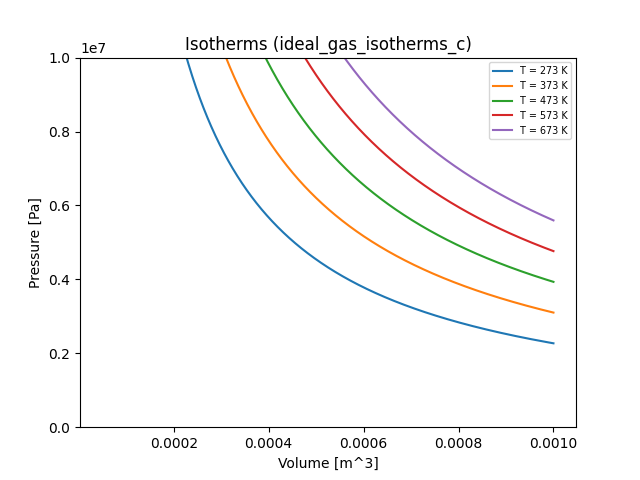
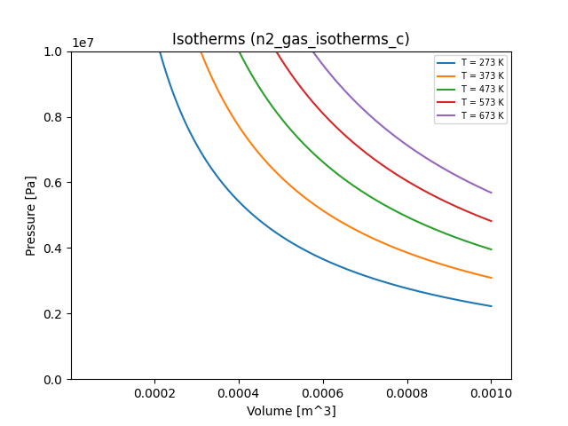
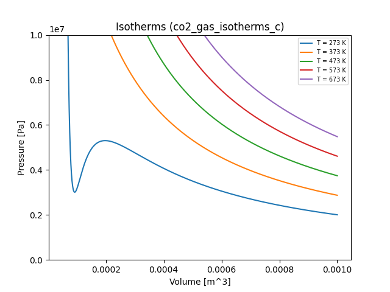
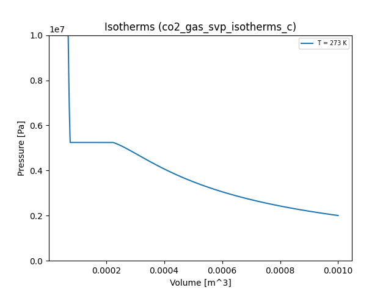

# Example: Van der Waals Gas

The example in this section focuses on the **Van der Waals gas law**, a
generalization of the ideal gas law that accurately describes many gases over
a great range of temperatures, pressures, and volumes. The example has three
parts.

In this example, we use the Standard International (SI, also called *mks*)
system of units. When we define a quantity, we denote its units in square
brackets. For example, the mass of an object could be written as $m$ [kg].
Quantities without units are followed by [-].

The code for the example is available in the
[examples folder](https://github.com/eagles-project/skywalker/tree/main/examples)
of the Skywalker source tree.

We'll use Python to make a few plots along the way. We use Python 3 and the
[matplotlib](https://matplotlib.org) library, which comes with many scientific
Python packages like [IPython](https://ipython.org). If you're not using one of
those packages, you can usually install matplotlib with a command like the
following:

```
pip3 install matplotlib
```

### Ideal gas

Recall that the ideal gas law relates the pressure, temperature, and volume of
a gas through the equation of state

$$
pV = \nu R T
$$

where

* $p$ is the gas pressure [Pa]
* $V$ is the volume occupied by the gas [m$^3$]
* $\nu$ is the number of moles of gas contained in the volume $V$ [-]
* $R$ is the universal gas constant [J $\cdot$ K$^{-1} \cdot$ mol$^{-1}$]
* $T$ is the temperature of the gas [K]

Strictly speaking, the ideal gas law holds for gases whose molecules don't
interact with one another. While this is not true for any known substance, it's
a good approximation for gases whose molecules interact only weakly.

### Van der Waals gas

The equation of state for the van der Waals gas law is a refinement of the ideal
gas law that attempts to model weak interactions between particles using a pair
of parameters $a$ and $b$. The equation is

$$
(p + a/V^2)(V - b) = \nu RT
$$

where $a$ represents the effects of **cohesive forces** within a molecule, and
$b$ represents effects of molecules having a **finite size**. Clearly, when
$a=b=0$, this equation reverts to the ideal gas law.

The Van der Waals approximation is a significant improvement on the ideal gas
law, and can be used to study various phenomena. Our discussion follows that in
Chapter IV of *Thermodynamics*, by Enrico Fermi, Dover Publications, NY (1936).

## Part 1: Plotting Isotherms

An isotherm is a thermodynamic process in which the temperature remains the
same throughout. Isothermal processes are important in any setting in which
smaller physical systems interact with a heat reservoir at a given temperature.
They are conveniently expressed using **PV diagrams**, which are just XY plots
with the volume $V$ on the $x$ axis and the pressure $p$ on the $y$ axis.

### Ideal gas

We can construct an isotherm curve for an ideal gas by writing the pressure $p$
as a function of $V$ and $T$ for a single mole of gas ($\nu = 1$):

$$
p(V, T) = \frac{RT}{V}
$$

Let's write a simple Skywalker program that takes $V$ and $T$ as input and
computes $p$ as output. Our program will read the following input file, named
`ideal_gas_isotherms`, which constructs an ensemble of $(V, T)$ pairs,
with $V \in [5^{-5}, 1^{-3}]$ m${^3}$ and $T$ assuming the values 273 K, 373 K,
473 K, 573 K, and 673 K.

=== "ideal_gas_isotherms.yaml"
    ```
    input:
      lattice:
        V: [5.0e-5, 1.0e-3, 1.0e-6]  # [m^3]
        T: [273, 373, 473, 573, 673] # [K]
    ```

Here's our program:

=== "C"

    ``` c linenums="1"
    // isotherms.c
    #include <skywalker.h>

    // This function retrieves the value with the given name from the given
    // input, exiting on failure.
    sw_real_t get_value(sw_input_t *input, const char *name) {
      sw_input_result_t in_result = sw_input_get(input, name);
      if (in_result.error_code != SW_SUCCESS) {
        fprintf(stderr, "isotherms_c: %s", in_result.error_message);
        exit(-1);
      }
      return in_result.value;
    }

    // Here's the main function.
    int main(int argc, char **argv) {
      const char *input_file = "ideal_gas_isotherms.yaml";

      // Load the ensemble. Any error encountered is fatal.
      printf("isotherms_c: Loading ensemble from %s...\n", input_file);
      sw_ensemble_result_t load_result = sw_load_ensemble(input_file, NULL);
      if (load_result.error_code != SW_SUCCESS) {
        fprintf(stderr, "isotherms_c: %s", load_result.error_message);
        exit(-1);
      }

      sw_ensemble_t *ensemble = load_result.ensemble;
      printf("isotherms_c: found %zd ensemble members.\n", sw_ensemble_size(ensemble));

      // Iterate over all members of the ensemble.
      sw_input_t *input;
      sw_output_t *output;
      while (sw_ensemble_next(ensemble, &input, &output)) {
        // Fetch (V, T) from the member's input.
        sw_real_t V = get_value(input, "V"); // gas (molar) volume [m3]
        sw_real_t T = get_value(input, "T"); // gas temperature [K]

        // Compute p(V, T).
        static const sw_real_t R = 8.31446261815324;
        sw_real_t p = R * T / V;

        // Stash the computed pressure in the member's output.
        sw_output_set(output, "p", p);
      }

      // Write out a Python module.
      const char *output_file = "ideal_gas_isotherms_c.py";
      printf("isotherms_c: Writing data to %s...\n", output_file);
      sw_write_result_t w_result = sw_ensemble_write(ensemble, output_file);
      if (w_result.error_code != SW_SUCCESS) {
        fprintf(stderr, "isotherms_c: %s\n", w_result.error_message);
        exit(-1);
      }

      // Clean up.
      sw_ensemble_free(ensemble);
    }
    ```

=== "C++"

    ``` c++ linenums="1"
    // isotherms.cpp
    #include <skywalker.hpp>

    int main(int argc, char **argv) {
      std::string input_file = "ideal_gas_isotherms.yaml";

      // Load the ensemble. Any error encountered is fatal.
      std::cout << "isotherms_cpp: Loading ensemble from " << input_file << "...\n";
      skywalker::Ensemble *ensemble = nullptr;
      try {
        ensemble = skywalker::load_ensemble(input_file);
      } catch (skywalker::Exception &e) {
        std::cerr << "isotherms_cpp: " << e.what() << std::endl;
        exit(-1);
      }
      std::cout << "isotherms_cpp: found " << ensemble->size() << " ensemble members.\n";

      // Iterate over all members of the ensemble.
      try {
        ensemble->process([](const skywalker::Input &input,
                             skywalker::Output &output) {
          // Fetch inputs.
          skywalker::Real V = input.get("V"); // gas (molar) volume [m3]
          skywalker::Real T = input.get("T"); // gas temperature [K]

          // Compute p(V, T).
          static const skywalker::Real R = 8.31446261815324;
          skywalker::Real p = R * T / V;

          // Stash the computed pressure in the member's output.
          output.set("p", p);
        });
      } catch (skywalker::Exception &e) {
        std::cerr << "isotherms_cpp: " << e.what() << "\n";
        exit(-1);
      }

      // Write out a Python module.
      std::string output_file = "ideal_gas_isotherms_cpp.py";
      std::cout << "isotherms_cpp: Writing data to " << output_file << "...\n";
      try {
        ensemble->write(output_file);
      } catch (skywalker::Exception &e) {
        std::cerr << "isotherms_cpp: " << e.what() << "\n";
        exit(-1);
      }

      // Clean up.
      delete ensemble;
    }
    ```

=== "Fortran"

    ``` fortran linenums="1"
    ! isotherms.F90
    program isotherms
      use iso_c_binding, only: c_float, c_double
      use skywalker
      implicit none

      ! Universal gas constant
      real(swp), parameter     :: R = 8.31446261815324_swp

      character(len=255)      :: input_file, output_file
      type(ensemble_result_t) :: load_result
      type(ensemble_t)        :: ensemble
      type(input_t)           :: input
      type(output_t)          :: output
      real(swp)               :: V, T, p, a, b

      input_file = "ideal_gas_isotherms.yaml"

      ! Load the ensemble. Any error encountered is fatal.
      print *, "isotherms_f90: Loading ensemble from ", trim(input_file), "..."
      load_result = load_ensemble(trim(input_file))
      if (load_result%error_code /= SW_SUCCESS) then
        print *, "isotherms_f90: ", trim(load_result%error_message)
        stop
      end if

      ensemble = load_result%ensemble
      print *, "isotherms_f90: found ", ensemble%size, " ensemble members."

      ! Iterate over all members of the ensemble.
      do while (ensemble%next(input, output))
        ! Fetch inputs.
        V = input%get("V") ! gas (molar) volume [m3]
        T = input%get("T") ! gas temperature [K]

        ! Compute p(V, T).
        p = R * T / V

        ! Stash the computed pressure in the member's output.
        call output%set("p", p);
      end do

      ! Write out a Python module.
      output_file = "ideal_gas_isotherms_f90.py"
      print *, "isotherms_f90: Writing data to ", output_file, "..."
      call ensemble%write(output_file)

      ! Clean up.
      call ensemble%free();
    end program
    ```

Click through the different tabs for the C, C++, and Fortran versions of the
program. You can see that they're very similar. Here's what's going on:

1. An ensemble is loaded with a `load_ensemble` function. If the attempt to
   load the ensemble fails, the program halts.
2. The members of the ensemble are processed one by one. In the C and Fortran
   programs, this happens in a `while`/`do while` loop, in which a call to
   `sw_ensemble_next` or `ensemble%next` associates the `input` and `output`
   variables with a specific ensemble member. In C++, this loop is hidden inside
   a call to `ensemble->process`, which accepts a lambda function whose
   arguments are the properly associated `input` and `output` variables for each
   member. Inside this loop:
    1. the gas volume $V$ and temperature $T$ are extracted from the `input`
       variable for the current ensemble member
    2. the gas pressure $p$ is computed from $V$ and $T$
    3. the computed pressure $p$ is stored in the `output` variable for the
       current ensemble member
3. After every ensemble member has been processed in Step 2, a Python module
   containing all input and output data for the ensemble is written.
4. The ensemble is deleted with an appropriate function call or command.

For a more detailed explanation of any of these steps, see the [API](api.md)
section.

If you like, copy and paste any version of the program into a text editor, save
it, and build it, linking it against `libskywalker.a` or `libskywalker_f90.a`
as needed. Then run it in a directory containing `ideal_gas_isotherms.yaml`,
and check to see that an appropriate `.py` file appears.

Here's a plot of the resulting isotherms:



If you want to generate this plot for yourself, run the
[plot_isotherms.py](https://github.com/eagles-project/skywalker/tree/main/examples/plot_isotherms.py)
script in the `examples/` folder of the repo on the appropriate `.py` file,
leaving out the `.py` suffix. E.g.

```
python3 plot_isotherms.py ideal_gas_isotherms_c
```

### Van der Waals gases

Now that we've successfully used Skywalker to plot the isotherms of an ideal
gas at several temperatures, we can generalize our program(s) to handle Van der
Waals gases. The expression for the gas pressure is

$$
p = \frac{RT}{V - b} - \frac{a}{V^2}
$$

First, we must add the two parameters $a$ and $b$ as input. Here's a YAML input
file that sets these parameters for diatomic nitrogen gas:

=== "n2_gas_isotherms.yaml"
    ```
    input:
      fixed:
        a: 0.137                     # [Pa m6/mol2]
        b: 3.87e-5                   # [m3/mol]
      lattice:
        V: [5.0e-5, 1.0e-3, 1.0e-6]  # [m^3]
        T: [273, 373, 473, 573, 673] # [K]
    ```

And here's one for carbon dioxide:

=== "co2_gas_isotherms.yaml"
    ```
    input:
      fixed:
        a: 0.3658                    # [J m3/mol2]
        b: 4.29e-5                   # [m3/mol]
      lattice:
        V: [5.0e-5, 1.0e-3, 1.0e-6]  # [m3]
        T: [273, 373, 473, 573, 673] # [K]
    ```

Now we must modify our programs to include these input parameters in the
calculation of the gas pressure. Here are code snippets that implement these
changes:

=== "C"
    Replace lines 38-40 with
    ``` c linenums="38"
        // Fetch Van der Waals parameters if they're present.
        sw_real_t a = 0.0, b = 0.0;
        if (sw_input_has(input, "a")) {
          a = get_value(input, "a");
        }
        if (sw_input_has(input, "b")) {
          b = get_value(input, "b");
        }

        // Compute p(V, T).
        static const sw_real_t R = 8.31446261815324;
        sw_real_t p = R * T / (V - b) - a/(V*V);

    ```
=== "C++"
    Replace lines 26-28 with
    ``` c++ linenums="26"
          // Fetch Van der Waals parameters if they're present.
          skywalker::Real a = 0.0, b = 0.0;
          if (input.has("a")) {
            a = input.get("a");
          }
          if (input.has("b")) {
            b = input.get("b");
          }

          // Compute p(V, T).
          static const skywalker::Real R = 8.31446261815324;
          skywalker::Real p = R * T / (V - b) - a/(V*V);
    ```
=== "Fortran"
    Declare `real(swp)` variables `a` and `b`, and replace lines 39-40 with
    ``` fortran linenums="39"
        ! Fetch Van der Waals parameters if they're present.
        a = 0.0_swp
        b = 0.0_swp
        if (input%has("a")) a = input%get("a")
        if (input%has("b")) b = input%get("b")

        ! Compute p(V, T).
        p = R * T / (V - b) - a/(V**2)
    ```

With these changes, the program can now build the ensembles indicated in the
`n2_gas_isotherms.yaml` and `co2_gas_isotherms.yaml` files. Here are all of the
resulting plots (including our ideal gas for comparison):

=== "Ideal gas"
    
=== "N2 gas"
    
=== "CO2 gas"
    

### Exercises

1. Experiment with different values of $a$ and $b$. Are there values that
   trigger interesting or surprising behavior? Try to interpret these values
   physically.

## Part 2: Determining the Saturation Vapor Pressure in Carbon Dioxide

You may be curious about what's happening with the blue curve representing the
isotherm for $T = 273$ K for carbon dioxide. If you follow the curve starting
from the right, it represents a compression process for the gas at a constant
temperature. Somewhere around $V = 2 \times 10^{-4}$ m$^3$, something funny
happens: the gas pressure *decreases* under compression. This simply doesn't
happen in reality. What's going on?

What's going on is a phase change: carbon dioxide condenses to liquid form
under these conditions. The gas is no longer in a homogeneous state, and the
Van der Waals equation of state isn't satisfied for the gas/liquid mixture.
Rather, the pressure (called the **saturation vapor pressure**) remains constant
alongside the temperature over the course of the phase change. One way to
understand this is that under a phase change, the system alters its binding
energy but not its kinetic energy. The pressure in a Van der Waals gas depends
only on its kinetic energy (because it assumes that the particles interact only
weakly), so it remains constant.

In other words, the saturation vapor pressure is a horizontal line $p(V) = p_s$
over the course of the phase change. It looks like this:



Suppose we wanted to modify our program to make use of these ideas. Our
objective is to find the value of the saturation pressure, or the height of the
horizontal line in the vicinity of the phase change. One might think that we
must use the [Clausius-Clapeyron equation](https://en.wikipedia.org/wiki/Clausius–Clapeyron_relation),
which involves the latent heat of evaporation and the specific volumes of the
gas and liquid phases. However, the shape of the isotherm in question actually
gives us enough geometric information to use an iterative approach that does a
decent job of estimating the saturation vapor pressure using
[Maxwell's equal area rule](https://en.wikipedia.org/wiki/Maxwell_construction).

### Approximating the saturation vapor pressure numerically

We don't have a curve $p(V)$ to work with in our calculation of $V_s$--we only
have a discrete set of points with volumes $\{V_i\}$ and pressures $\{p_i\}$.
Let $i_1$ be the index of the first point along the (horizontal) phase change
curve, and let $i_2$ be the index of the last point along this curve. These two
points have the same pressure, which is the saturation vapor pressure. How do
we determine them?

Suppose we start the points at two distinctive locations and move them around
till they have equal pressure. For example, we can set $i_1$ to the point at
the trough of the Van der Waals isotherm, and $i_2$ to the local peak to the
right of this trough. Then we know that our initial value of $i_1$ is too large,
and that our initial value of $i_2$ is too small.

We can now devise an iterative scheme that moves $i_1$ and $i_2$ apart until
the difference in their pressures hits a minimum.

```
 pdiff := abs(p(i2) - p(i1))
 Do forever
   # Trying moving i1 to the left, reversing if we hit a higher
   # pressure difference.
   prev_i1 := i1
   i1 := i1 - 1
   p21 := abs(p(i2) - p(i1))
   if p21 < pdiff
     pdiff := p21
   else
     i1 := i1 + 1

   # Trying moving i2 to the right.
   prev_i2 := i2
   i2 := i2 + 1
   p21 := abs(p(i2) - p(i1))
   if p21 < pdiff
     pdiff := p21
   else
     i2 := i2 - 1

   # If we didn't move either point, we're finished.
   if i1 = prev_i1 and i2 = prev_i2
     break
```

Once we've found a plausible saturation vapor pressure, we can increase or
decrease it until the areas bounded by the original curve and the flat
saturation pressure sum to zero. These areas are described by the integral of
the pressure over the range of volumes in question, so what we're looking for
is

$$
  \int_{V_1}^{V_2} (p - p_s) \texttt{d}V = 0,
$$

or

$$
  \int_{V_1}^{V_s} (p - p_s) \texttt{d}V + \int_{V_s}^{V_2} (p - p_s) \texttt{d}V = 0,
$$

where $p_s = p(V_s)$ is the saturation vapor pressure and $V_1$ and $V_2$ are,
respectively, the minimum and maximum volumes at which $p(V) = p_s$ in the
original Van der Waals pressure curves. These integrals can be approximated
using a simple quadrature rule such as the midpoint rule.

### Exercises

1. Try to implement this iterative scheme to compute the saturation vapor
   pressure for the above isotherm. (Hint: use an input that specifies a
   single temperature.) Extra credit: can you add a setting to your program
   that specifies whether or not to compute the saturation vapor pressure?
   You can read about settings in the [Input Format](input.md) and [API](api.md)
   sections.
2. Can you find the critical point for carbon dioxide by exploring various
   Van der Waals isotherms? How do you know when you've found it?

